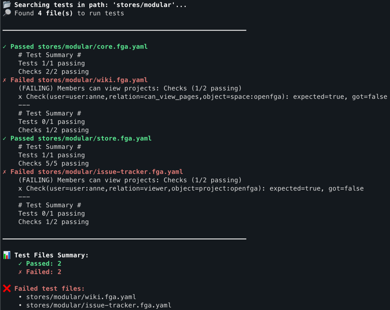

# OpenFGA Test Runner

:octocat: Action that allows you to run OpenFGA test seamlessly.

This action recursively searches through the specified location (by default: root directory) for `*.fga.yaml` files and
executes them as OpenFGA test cases.

## Prerequisites

⚠️ This action **requires** [FGA CLI](https://openfga.dev/docs/getting-started/cli) to be installed in your environment.
See the example workflow below for installation instructions.

## Example workflow

Create your GitHub Workflow configuration in `.github/workflows/ci.yml` or similar.

```yaml
name: CI

on: [ push ]

jobs:
  build:
    runs-on: ubuntu-latest

    steps:
      - name: Checkout code
        uses: actions/checkout@11bd71901bbe5b1630ceea73d27597364c9af683 # v4.2.2
        with:
          fetch-depth: 0

      - name: Install the latest FGA CLI
        run: |
          FGA_CLI_VERSION=$(curl -sL https://api.github.com/repos/openfga/cli/releases/latest | jq -r ".tag_name")
          curl -sLS https://github.com/openfga/cli/releases/download/${FGA_CLI_VERSION}/fga_${FGA_CLI_VERSION#v}_linux_amd64.deb -o fga-cli.deb
          sudo dpkg -i ./fga-cli.deb

      - name: Run tests
        uses: piotrooo/openfga-test-runner@v0.0.1
```

## Usage

```yaml
- uses: piotrooo/openfga-test-runner@v0.0.1
  with:
    # Directory path from which the action recursively searches for .fga.yaml test files (default: root directory)
    location: ''
```

## Output



## License

The scripts and documentation in this project are released under the [MIT License](LICENSE).
